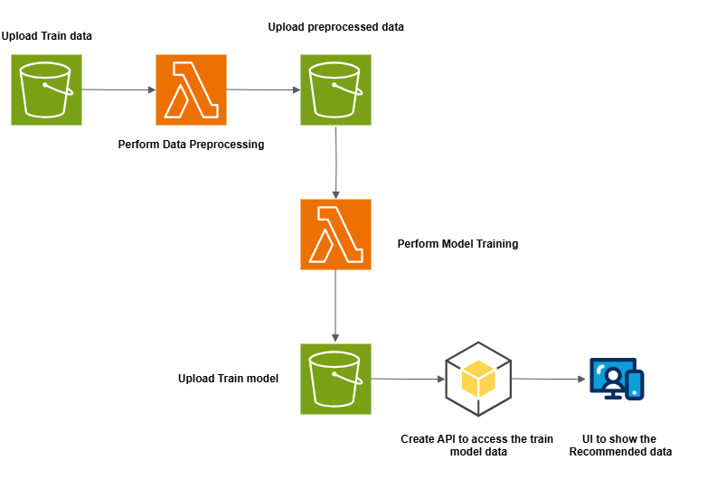

# Movies Recommendation API



#### Installation

```
python -m venv venv # create virtual environment
venv/Script/activate # activate virtual environment
pip install -r requirements.txt
```

#### Set AWS Profile

```
$env:AWS_PROFILE=aws_config_profile
```

#### Login to AWS SSO specific config profile

```
aws sso login --profile aws_config_profile 
```

### Check the SSO Token taking from correct SSO Profile or not

```
aws sts get-caller-identity
```

#### Run the project

```
uvicorn main:app --reload
```

#### For Lambda backend code of this project refer the below repository

[movies-recommendation-lambda-function](https://github.com/Ashuk25/movies-recommendation-lambda-function.git)

#### For UI Code refere this repository
[movies-recommendation-frontend](https://github.com/Ashuk25/movies-recommendation-frontend.git)